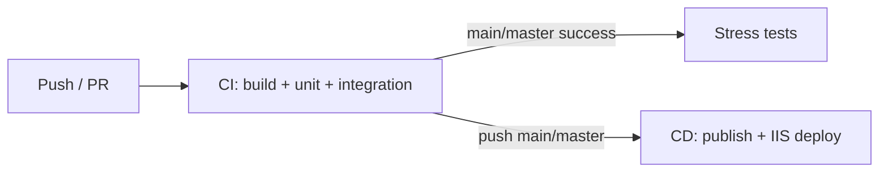

# User Management API (ASP.NET Core + CI/CD Demo)

A course-oriented REST API for user CRUD, lock/unlock, with GitHub Actions (unit, integration, and stress tests) and automated deployment to IIS.

## Tech stack

- ASP.NET Core 8 Web API
- Entity Framework Core (**SQLite** for dev/CI, **SQL Server** for IIS production)
- xUnit + WebApplicationFactory

## API endpoints

| Method | Path | Description |
|--------|------|-------------|
| GET | `/api/users` | List users |
| GET | `/api/users/{id}` | Get user by id |
| POST | `/api/users` | Create user |
| PUT | `/api/users/{id}` | Update user |
| POST | `/api/users/{id}/lock` | Lock user |
| POST | `/api/users/{id}/unlock` | Unlock user |
| DELETE | `/api/users/{id}` | Delete user |
| GET | `/health` | Health check |

### Create user example

```json
POST /api/users
{ "email": "alice@example.com", "displayName": "Alice" }
```

## Local development

```powershell
cd UserManagementApi
dotnet restore
dotnet ef database update --project src/UserManagement.Infrastructure --startup-project src/UserManagement.Api
dotnet run --project src/UserManagement.Api
```

Swagger (Development): `https://localhost:7xxx/swagger`

## Run tests locally

```powershell
dotnet test tests/UserManagement.UnitTests
dotnet test tests/UserManagement.IntegrationTests
dotnet test tests/UserManagement.StressTests
```

## Project structure

```
UserManagementApi/
├── src/
│   ├── UserManagement.Api/              # Web API
│   ├── UserManagement.Core/             # Domain models and services
│   └── UserManagement.Infrastructure/   # EF Core + repositories
├── tests/
│   ├── UserManagement.UnitTests/
│   ├── UserManagement.IntegrationTests/
│   └── UserManagement.StressTests/
├── deploy/
│   └── deploy-to-iis.ps1
└── .github/workflows/
    ├── ci.yml
    ├── stress-tests.yml
    └── cd-iis.yml
```

---

## CI/CD overview

| Workflow | File | Trigger | Runner | Purpose |
|----------|------|---------|--------|---------|
| **CI** | `.github/workflows/ci.yml` | Push / PR to `main`, `master`, `develop` | `ubuntu-latest` | Build, unit tests, integration tests |
| **Stress** | `.github/workflows/stress-tests.yml` | After CI succeeds on `main`/`master`, or manual | `ubuntu-latest` | Stress tests |
| **CD** | `.github/workflows/cd-iis.yml` | Push to `main`/`master`, or manual | Self-hosted `Windows` + `IIS` | Publish and deploy to IIS |

Pipeline flow:



---

## Prerequisites (what to configure before CI/CD works)

### 1. GitHub repository

- Push this repo to GitHub (or GitHub Enterprise).
- Default branch should be `main` or `master` (workflows listen to both).
- **Actions** must be enabled: **Settings → Actions → General → Allow all actions**.

No repository secrets are required for **CI** or **stress tests**; they run on GitHub-hosted Ubuntu runners with SQLite/in-memory databases.

### 2. CI (build + tests) — minimal setup

| Item | Required? | Notes |
|------|-----------|--------|
| GitHub Actions enabled | Yes | Uses `actions/checkout@v4`, `actions/setup-dotnet@v4` |
| .NET 8 SDK | Automatic | `DOTNET_VERSION: 8.0.x` in workflows |
| NuGet | Automatic | `nuget.config` points to nuget.org |
| Secrets / variables | No | Integration tests use in-memory SQLite (`Testing` environment) |

**Optional:** branch protection on `main`/`master` requiring the **CI** workflow to pass before merge.

### 3. Stress tests — minimal setup

| Item | Required? | Notes |
|------|-----------|--------|
| CI workflow name | Yes | Must stay `CI` (stress workflow references `workflows: [CI]`) |
| Secrets / variables | No | Same as CI |
| Manual run | Optional | **Actions → Stress Tests → Run workflow** |

Stress runs only when CI completes **successfully** on `main` or `master` (or when triggered manually).

### 4. CD (IIS deploy) — full setup required

CD does **not** run on GitHub-hosted runners. You must provide a **self-hosted Windows runner** on the IIS machine (or a machine that can reach IIS and the deploy path).

#### 4.1 Windows / IIS server

| Component | Purpose |
|-----------|---------|
| **IIS** | Host the API site |
| **ASP.NET Core Hosting Bundle** (.NET 8) | IIS module + runtime for in-process hosting |
| **Database** | Demo: **SQLite** file under site `data/` (default). Optional: SQL Server + `IIS_CONNECTION_STRING` |
| **PowerShell** (pwsh) | CD workflow runs `deploy/deploy-to-iis.ps1` |
| **Administrator rights** | Deploy script uses `#Requires -RunAsAdministrator` (app pool stop/start, file copy) |

Install Hosting Bundle: [.NET 8 – Hosting Bundle](https://dotnet.microsoft.com/download/dotnet/8.0) (Windows → Hosting Bundle).

Ensure the app pool uses **No Managed Code** (the script sets `managedRuntimeVersion` to empty for ASP.NET Core).

#### 4.2 Database (demo vs production)

**Course demo (no SQL Server):** `appsettings.Production.json` uses **SQLite** (`data/usermanagement.db` under the site folder). You do **not** need `IIS_CONNECTION_STRING`; leave that secret empty or unset. Migrations run on app startup.

**Real production:** switch `Database:Provider` to `SqlServer`, set `IIS_CONNECTION_STRING` in GitHub, and create the SQL Server database. The deploy script overwrites `ConnectionStrings:DefaultConnection` only when the secret is set.

#### 4.3 GitHub self-hosted runner (step-by-step)

Use the same Windows machine where IIS runs (your laptop is fine for a demo).

1. **Enable IIS** (Windows Features): Web Server (IIS) → include **Web Server** and **Management Tools**.
2. Install **[ASP.NET Core 8 Hosting Bundle](https://dotnet.microsoft.com/download/dotnet/8.0)** and restart IIS: `iisreset`.
3. On GitHub: **repo → Settings → Actions → Runners → New self-hosted runner → Windows x64**.
4. On the Windows machine, open **PowerShell as Administrator** in an empty folder (e.g. `C:\actions-runner`), then run the three commands GitHub shows, for example:

```powershell
# Example — use the exact URL/token from your repo page
mkdir C:\actions-runner; cd C:\actions-runner
Invoke-WebRequest -Uri https://github.com/actions/runner/releases/download/v2.321.0/actions-runner-win-x64-2.321.0.zip -OutFile actions-runner-win-x64.zip
Expand-Archive actions-runner-win-x64.zip -DestinationPath .
.\config.cmd --url https://github.com/YOUR_ORG/UserManagementApi --token YOUR_ONE_TIME_TOKEN --labels Windows,IIS
```

- `self-hosted` is added automatically; you must add **`Windows`** and **`IIS`** (comma-separated in `--labels`).
- When prompted for runner group, press Enter for default.

5. Install and start the runner **as a Windows service** (still in elevated PowerShell):

```powershell
.\svc.cmd install
.\svc.cmd start
```

The service usually runs as **Local System**, which can stop/start IIS app pools and satisfies the deploy script’s admin requirement.

6. Confirm in GitHub: runner status **Idle**, labels include `self-hosted`, `Windows`, `IIS`.

**If deploy fails with “requires RunAsAdministrator”:** reinstall the service from an elevated prompt, or in `services.msc` set **GitHub Actions Runner** to log on as an administrator account.

**Optional — run without service (quick test):** in elevated PowerShell, `.\run.cmd` (terminal must stay open; stops when closed).

#### 4.4 GitHub Environment `production`

**Settings → Environments → New environment → `production`**

| Type | Name | Demo value | Notes |
|------|------|------------|--------|
| **Variable** | `IIS_SITE_NAME` | `UserManagementApi` | Any name; script creates site if missing |
| **Variable** | `IIS_APP_POOL` | `UserManagementApiPool` | App pool name |
| **Variable** | `IIS_PHYSICAL_PATH` | `C:\inetpub\wwwroot\UserManagementApi` | Must exist or script creates folder |
| **Secret** | `IIS_CONNECTION_STRING` | *(leave empty for demo)* | Only needed for SQL Server override |

If all three variables are omitted, `deploy-to-iis.ps1` uses the same defaults as in the table above.

**Optional:** environment protection rules (required reviewers, wait timer) before deploy runs.

#### 4.5 CD checklist (quick reference)

- [ ] Code on GitHub, Actions enabled
- [ ] IIS + ASP.NET Core 8 Hosting Bundle installed
- [ ] (Demo) SQLite only — skip SQL Server and `IIS_CONNECTION_STRING`
- [ ] Self-hosted runner online with labels `self-hosted`, `Windows`, `IIS`
- [ ] Runner service installed from elevated PowerShell
- [ ] Environment **`production`** with three IIS variables (secret optional for demo)
- [ ] Push to `main` or `master` (or run **CD - Deploy to IIS** manually)

---

## CI/CD step-by-step

### Step 1 — Enable CI on every push/PR

1. Push code to `main`, `master`, or `develop`, or open a PR targeting those branches.
2. Open **Actions → CI**.
3. Confirm three jobs succeed: **Build**, **Unit Tests**, **Integration Tests**.
4. Download test artifacts (**unit-test-results**, **integration-test-results**) if needed.

What CI does:

- `dotnet restore` / `dotnet build` (Release)
- Unit tests with TRX logs and code coverage collection
- Integration tests against in-memory SQLite

### Step 2 — Stress tests after CI (main/master)

1. Merge or push to `main` or `master` so CI completes successfully.
2. **Stress Tests** workflow starts automatically (`workflow_run` on **CI**).
3. Or run manually: **Actions → Stress Tests → Run workflow**.

### Step 3 — Deploy to IIS (CD)

**Automatic:** push to `main` or `master` triggers **CD - Deploy to IIS**.

**Manual:** **Actions → CD - Deploy to IIS → Run workflow**.

Deploy steps:

1. Checkout on the self-hosted runner.
2. `dotnet publish` → `./publish`
3. `deploy/deploy-to-iis.ps1`:
   - Stop app pool
   - Copy published files to `IIS_PHYSICAL_PATH`
   - Patch `appsettings.Production.json` with `IIS_CONNECTION_STRING`
   - Ensure `web.config` for ASP.NET Core Module V2
   - Start app pool

4. Verify: `GET http://<server>:<port>/health` (default site port `8080` if the script created the site).

### Step 4 — Verify production

```powershell
# Example (adjust host/port)
Invoke-RestMethod http://localhost:8080/health
Invoke-RestMethod http://localhost:8080/api/users
```

Check IIS logs under `<IIS_PHYSICAL_PATH>\logs\` if the site fails to start.

---

## Troubleshooting

| Symptom | Likely cause |
|---------|----------------|
| CI fails on restore | Network / nuget.org blocked; check `nuget.config` |
| Stress never runs | CI failed, or push was not to `main`/`master`, or workflow name changed from `CI` |
| CD job queued forever | No self-hosted runner, or missing `Windows` / `IIS` labels |
| CD fails on deploy script | Runner not elevated; IIS module missing; invalid paths |
| 502.5 / app won't start | Hosting Bundle not installed; wrong `dotnet` on PATH for app pool |
| Database errors | Wrong `IIS_CONNECTION_STRING`; SQL Server unreachable; permissions |

---

## Workflow files reference

- **CI:** `.github/workflows/ci.yml` — build + unit + integration tests
- **Stress:** `.github/workflows/stress-tests.yml` — stress tests after CI
- **CD:** `.github/workflows/cd-iis.yml` — publish + IIS deploy via `deploy/deploy-to-iis.ps1`
